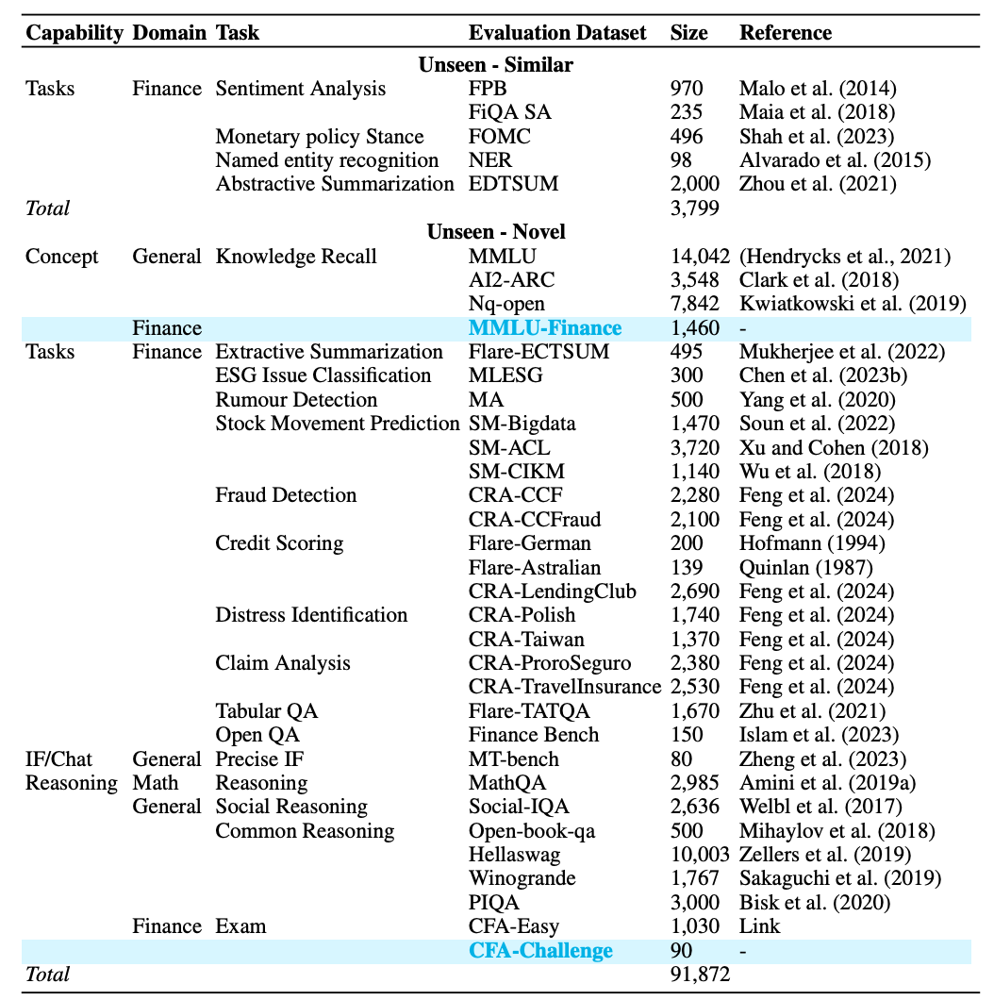

# Demystifying Domain-adaptive Post-training for Financial LLMs

<p align="center">
     <br>
</p>

This is the codebase for [Demystifying Domain-adaptive Post-training for Financial LLMs](https://arxiv.org/abs/2501.04961). 

*Given a pre-trained LLM with strong general capabilities (e.g., Llama3-8b-instruct), how to effectively adapt it to a target domain by post-training? What criteria are desirable for successful adaptation? What are effective training recipes with respect to data and model?*

✨ FinDAP a novel finance-specific post-training framework comprising a comprehensive evaluation framework, state-of-the-art model checkpoints and a training recipe. We use the finance domain as a case study to perform domain-adaptive post-training on the instruction-tuned LLM

<p align="center">
     <br>
An overview of FinDAP. <strong>Left</strong>: we first identify the core expected capabilities for the target domain and then curate texts and prompts for training and evaluation. <strong>Right</strong>: the top shows our training strategies. For each training stage, we use development set to select the best model. After training, we use unseen set to demonstrate the effectiveness of the post-trained LLM.
</p>

## Updates
- Jan 26: Evaluation benchmark (<strong>FinEval</strong>) is now available on [Huggingface Dataset](https://huggingface.co/datasets/Salesforce/FinEval)! More datasets and checkpoints will  be released soon.

## 💪 FinDAP Capabilities
We begin by illustrating the capabilities that are desirable for a domain-specific LLM. Specifically, we focus on the following core capabilities: 

- **Domain specific concepts.** A domain typically includes its own specific concepts. For example, ‘bond’ in finance refers to a loan agreement between an investor and a borrower. Adapting the LLM to domain-specific concepts is crucial, as these concepts form the fundamental building blocks of domain knowledge. However, this adaptation should not come at the cost of losing knowledge about general concepts, which are essential for both domain-specific and general tasks.  
- **Domain specific tasks.** While many NLP tasks, such as NER or sentiment analysis, are shared across different domains, a domain typically has its own tasks. For example, stock movement detection is primarily found in finance. Adapting LLMs to these domain-specific tasks is important, as it demonstrates how they can leverage domain-specific concepts to solve tailored tasks effectively.
- **Reasoning.** For complex tasks, reasoning with concepts is a highly desired capability in LLMs. For example, in finance, the LLM is often required to analyze a company’s financial report, involving extensive reasoning, particularly mathematical reasoning, to compute key financial concepts such as market rate or earnings per share.   
- **Instruction-Following and chat.** This is a core capability for both general and domain-specific LLMs, as tasks are often presented in the form of instruction following or conversation.
- **Others.** Additionally, domains may vary significantly in their sensitivity. For instance, the medical domain is highly sensitive, requiring utmost accuracy and strict adherence to ethical considerations. In contrast, domains such as entertainment may have more relaxed requirements. Another important consideration is multi-modality, as some domains require handling multiple types of input and output formats. For example, the healthcare domain may involve processing medical images alongside textual reports, while the e-commerce domain may integrate product descriptions, images, and customer reviews into a unified response. Similarly, scientific research often combines charts, graphs, and textual analysis to present findings effectively. While we acknowledge these additional aspects, we leave those for future work and concentrate on the four primary capabilities discussed above.

## 🔍 FinDAP Evaluation (FinEval) [[Huggingface Dataset](https://huggingface.co/datasets/Salesforce/FinEval)]
With the above breakdown of capabilities, our evaluation framework consists of a suite for assessing these capabilities using development sets and unseen (held-out) evaluation sets. Our development set is directly split from the training data at each stage. Below Table outlines the capabilities and the evaluation benchmarks selected to cover these capabilities.
<p align="center">
     <br>
Summary of FinEval. New datasets released with FinDAP are color-highlighted for emphasis.
</p>


### 🚀 FinEval Quick Start 


FinEval can be easily evaluated using standard evaluation scripts. As an example, we recommend use [llm-evaluation-harness](https://github.com/EleutherAI/lm-evaluation-harness) to load the dataset and evaluate it with minimal effort. Feel free to modify the code to integrate it with your existing evaluation scripts.

Firstly, we can refer to [llm-evaluation-harness](https://github.com/EleutherAI/lm-evaluation-harness) for installation
```bash
git clone --depth 1 https://github.com/EleutherAI/lm-evaluation-harness
cd lm-evaluation-harness
pip install -e . 
```
Secondly, we can change the task `.yaml` file (take `CFA-challenge` as an example):

```yaml
task: cfa-challenge
dataset_path: Salesforce/FinEval
dataset_name: CFA-Challenge
output_type: generate_until
test_split: test
doc_to_text: query
doc_to_target: answer
should_decontaminate: true
doc_to_decontamination_query: query
generation_kwargs:
  until:
    - "</s>"
    - "<|im_end|>"
    - "<|eot_id|>"
    - "<|end_of_text|>"
    - "<|end|>"
    - "<|endoftext|>"
  do_sample: false
  temperature: 0.0
  max_gen_toks: 8000
metric_list:
  - metric: exact_match
    aggregation: mean
    higher_is_better: true
    ignore_case: true
    ignore_punctuation: true
metadata:
  version: 1.0
```
Finally, we can run the evaluation script:

```bash


huggingface-cli login --token {YOUR_HF_TOKEN}

export HF_DATASETS_CACHE= {YOUR_CACHE_LOC}
export TRANSFORMERS_CACHE= {YOUR_CACHE_LOC}
export TRUST_REMOTE_CODE=1

# Example system prompt
system_prompt= "Please act as a CFA exam taker and evaluate the given scenario to choose the most appropriate answer from options A, B, and C. Start by offering a brief explanation of your thought process and reasoning, up to 100 words. After the explanation, select your answer using the format: 'Selection: [[A]]' (e.g., 'Explanation: (your explanation)\nSelection: [[A]]'). If you find no answer is correct, directly mention it"

# Example model
model=meta-llama/Meta-Llama-3-8B-Instruct

lm_eval --apply_chat_template --model vllm --log_samples --write_out --model_args pretrained=${model},max_length=8000,dtype=bfloat16,trust_remote_code=True,tensor_parallel_size={YOUR_NUM_GPU},gpu_memory_utilization=0.6  --system_instruction "$system_prompt" --tasks cfa-challenge --device cuda --output_path {YOUR_OUTPUT_LOC} --batch_size auto --num_fewshot 0
```


### Ethical Considerations
This release is for research purposes only in support of an academic paper. Our datasets and code are not specifically designed or evaluated for all downstream purposes. We strongly recommend users evaluate and address potential concerns related to accuracy, safety, and fairness before model deployment. We encourage users to consider the common limitations of AI, comply with applicable laws, and leverage best practices when selecting use cases, particularly for high-risk scenarios where errors or misuse could significantly impact people’s lives, rights, or safety. For further guidance on use cases, refer to our [AUP](https://www.salesforce.com/content/dam/web/en_us/www/documents/legal/Agreements/policies/ExternalFacing_Services_Policy.pdf) and [AI AUP](https://www.salesforce.com/content/dam/web/en_us/www/documents/legal/Agreements/policies/ai-acceptable-use-policy.pdf). 
## Citation

If you find our project helpful, please consider citing our paper :blush:

```
@misc{ke2025demystifyingdomainadaptiveposttrainingfinancial,
      title={Demystifying Domain-adaptive Post-training for Financial LLMs}, 
      author={Zixuan Ke and Yifei Ming and Xuan-Phi Nguyen and Caiming Xiong and Shafiq Joty},
      year={2025},
      eprint={2501.04961},
      archivePrefix={arXiv},
      primaryClass={cs.CL},
      url={https://arxiv.org/abs/2501.04961}, 
}
```